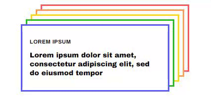
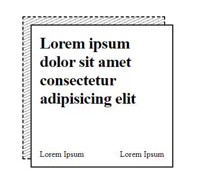

<h2>Fluff Tail</h2>
Fluff-tail is a custom component library for React

## Components currently supported

<details>
  <summary>Card</summary>

- [Rainbow Stacked Accordian](https://github.com/naveenkash/fluff-tail/tree/master/components/card/RainbowStackedAccordian)
- [Card Hover Interaction](https://github.com/naveenkash/fluff-tail/tree/master/components/card/CardHoverInteraction)
- [Article Deck](https://github.com/naveenkash/fluff-tail/tree/master/components/card/ArticleDeck)
- [Folding Card](https://github.com/naveenkash/fluff-tail/tree/master/components/card/FoldingCard)
</details>

## How to install

    npm i fluff-tail

Import component that you want to use

### Example

```jsx
import { CardHover } from "fluff-tail";

<CardHover
  title={"Title"}
  desc={
    "Lorem ipsum dolor sit amet, consectetur adipiscing elit, sed do eiusmod tempo incididunt"
  }
  href={"https://toyoursite.com"}
  btnTitle={"Go to My Site"}
  image={"Pass in a background image"}
  alt={"alt text for image"}
  openNewPage={true} // target set to _blank when set to true
  showBtn={true} // Wheather to show button or not
/>;
```

## How to use

<details>

  <summary>Card</summary>

<details>
  <summary>Rainbow Stacked Accordian</summary> <br/>

```js
import { Accordian } from "fluff-tail";
```



| Prop         | Type    | What they do                                          |
| ------------ | ------- | ----------------------------------------------------- |
| headingColor | string  | color for the heading                                 |
| descColor    | string  | color for the description                             |
| href         | string  | url to route to when user click button                |
| title        | string  | title text                                            |
| desc         | string  | description text                                      |
| openNewPage  | boolean | when user click open link in new page `default false` |

</details>

<details>
  <summary>Card Hover Interaction</summary> <br/>

```js
import { CardHover } from "fluff-tail";
```


| Prop        | Type    | What they do                                          |
| ----------- | ------- | ----------------------------------------------------- |
| image       | string  | image for the background                              |
| alt         | string  | alt text for image                                    |
| href        | string  | url to route to when user click button                |
| title       | string  | title text                                            |
| desc        | string  | description text                                      |
| btnTitle    | string  | button text                                           |
| openNewPage | boolean | when user click open link in new page `default false` |
| showBtn     | boolean | wheather to show button or not `default true`         |

</details>

<details>
  <summary>Article Deck</summary> <br/>

```js
import { ArticleDeck } from "fluff-tail";
```


| Prop          | Type    | What they do                                          |
| ------------- | ------- | ----------------------------------------------------- |
| number        | number  | number of card to draw (1-4)                          |
| subTitle      | string  | text for the sub title                                |
| href          | string  | url to route to when user click button                |
| title         | string  | title text                                            |
| subTitleColor | string  | sub title color                                       |
| TitleColor    | string  | title color                                           |
| openNewPage   | boolean | when user click open link in new page `default false` |
| width         | number  | width of the card                                     |
| height        | number  | height of the card                                    |

</details>

<details>
  <summary>Folding Card</summary> <br/>

```js
import { FoldingCard } from "fluff-tail";
```



| Prop                 | Type    | What they do                                          |
| -------------------- | ------- | ----------------------------------------------------- |
| href                 | string  | url to route to when user click                       |
| title                | string  | title text                                            |
| desc                 | string  | description text                                      |
| subTitleLeft         | string  | text for left sub title                               |
| subTitleRight        | string  | text for right sub title                              |
| backgroundColor      | string  | background color of the card                          |
| openNewPage          | boolean | when user click open link in new page `default false` |
| titleColor           | string  | color for the title                                   |
| folderHoverColor     | string  | background color for the folding card when hover      |
| mainBorderColor      | string  | border color for the front card / main card           |
| secondaryBorderColor | string  | border color for the back card / secondary card       |
| arrowColor           | string  | color for the arrow                                   |
| subTitleColor        | string  | color for the sub-title both left and right           |
| stripeColor          | string  | color for the stripes on back card                    |
| width                | number  | width of the card                                     |
| height               | number  | height of the card                                    |

</details>

</details>
