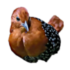

<h2 align="center">Fluff Tail</h2>
Fluff-tail is a custom component library for React

---

## Components we support

<details>
  <summary>Card</summary>

- [Rainbow Stacked Accordian](https://github.com/naveenkash/fluff-tail/tree/master/components/card/RainbowStackedAccordian)
- [Card Hover Interaction](https://github.com/naveenkash/fluff-tail/tree/master/components/card/CardHoverInteraction)
</details>

---

## How to use 

Import component that you want to use 

### Example

```jsx

import { CardHover } from "fluff-tail";

<CardHover
    title={"Title"}
    desc={"Lorem ipsum dolor sit amet, consectetur adipiscing elit, sed do eiusmod tempo incididunt"}
    href={"https://toyoursite.com"}
    btnTitle={"Go to My Site"}
    image={"Pass in a background image"}
/>
```